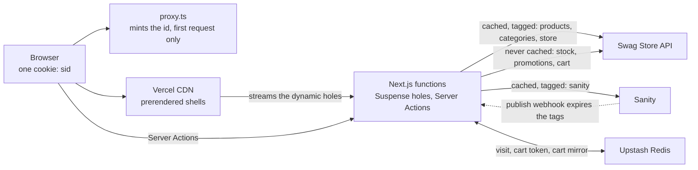

# Vercel Swag Store

## What this is

A storefront for Vercel swag, built on Next.js 16 with Cache Components. Every page is a
prerendered shell served from the CDN, and the parts that differ per visitor — stock, the
promotion, the cart — stream into it through Suspense boundaries. The Vercel Swag Store
API owns every commerce fact. Sanity holds the marketing copy and the product enrichment
layered on top, and never overrides one.

| | |
|---|---|
| Store | <https://vercel-swag-store-ms.vercel.app> |
| Studio | <https://swagstore-ms.sanity.studio> |

The products are invented and nothing is for sale, so every response carries
`X-Robots-Tag: noindex` and the store stays out of search. There is no licence: the code
is published to be read, not reused.

## Architecture

The API is the source of truth. Products, prices, categories, the featured flag, stock,
promotions and the cart all come from it, and nothing else may contradict it. Sanity holds
what a marketing team would write: the home hero, the section headings, a longer product
description, care text, testimonials and questions. The two are merged at render time and
the API wins any conflict (`docs/adr/0003-sanity-mirrors-api-products-and-categories.md`).

Three rules carry the design.

1. **Catalogue data is cached and tagged.** Every read of products, categories or the
   store config sits behind a typed function marked `"use cache"`, so the shell of a page
   is built once and served from the CDN.
2. **Live data is never cached.** Stock, the promotion and the cart are read per visitor,
   inside Suspense boundaries, which keeps them out of the shell.
3. **Live data is remembered per visitor.** The API redraws stock and the promotion on
   every request, so the store asks once per visitor and keeps the answers for a day, next
   to the cart token and a mirror of the cart, under one session id
   (`docs/adr/0006-the-stable-visit.md`, `docs/adr/0007-the-session-store.md`).



Workspace layout:

```
apps/store            Next.js 16 storefront, Cache Components on
apps/studio           Sanity Studio
apps/functions        Sanity Functions, one folder each
packages/sanity       schemas, client factory, GROQ queries, generated types
packages/demand       the search-gap loop's shared logic
packages/config       shared tsconfig and ESLint config
sanity.blueprint.ts   what Sanity runs for this repo, declared in code
specs/                one spec per epic, plus decisions.md and callout.md
docs/                 ADRs, the build output, the static-versus-dynamic map, Lighthouse
```

## Static vs dynamic

Every page route is a partial prerender: its shell is HTML built at build time, its live
parts stream in per request. No page route is fully dynamic. The route table from
`pnpm --filter store build`, with the per-slug entries collapsed:

```
Route (app)                             Revalidate  Expire
◐ /                                             1h      1d
◐ /cart                                         1h      1d
◐ /checkout                                     1h      1d
◐ /products                                     1h      1d
◐ /products/[slug]                              1h      1d   one page per product, plus a fallback shell
◐ /products/category/[slug]                     1h      1d   one page per category
◐ /search                                       1h      1d
● /md/product/[slug]                            1h      1d   one page per product
● /md/category/[slug]                           1h      1d   one page per category
○ /md/home, /md/products, /llms.txt             1h      1d
○ /opengraph-image, /robots.txt, /sitemap.xml
ƒ /api/*                                                     route handlers

○  (Static)             prerendered as static content
●  (SSG)                prerendered as static HTML (uses generateStaticParams)
◐  (Partial Prerender)  prerendered as static HTML with dynamic server-streamed content
ƒ  (Dynamic)            server-rendered on demand
```

| Route | In the prerendered shell | Streams per request |
|---|---|---|
| `/` | Hero, featured grid, favourites, chrome | Promo strip, cart badge |
| `/products`, `/products/category/[slug]` | Heading, category intro, every card | Promo strip, cart badge |
| `/products/[slug]` | Gallery, name, price, descriptions, testimonials, questions, JSON-LD | Stock with Add to Cart, promo strip, cart badge |
| `/search` | Heading, the search form with its category list, the results region | Results grid, form state, promo strip, cart badge |
| `/cart` | Heading, the skeleton's box, chrome | Cart contents, favourites row, promo strip, cart badge |
| `/checkout` | The whole page | Promo strip, cart badge |
| `/md/**`, `/llms.txt`, `/robots.txt`, `/sitemap.xml` | The whole file | nothing |

The rule that keeps it that way: anything reading `cookies()`, `headers()` or
`searchParams` renders inside a Suspense boundary. The session id is a cookie, so the
promo strip, the stock hole, the cart badge and the cart contents are all such cases;
`/search` passes the `searchParams` promise down without awaiting it, because awaiting it
in the page would make the whole route dynamic. `proxy.ts` mints the session cookie with
no I/O, and its matcher skips every request that already carries a valid id, so those are
served from the CDN without invoking it.

No page and no layout is a client component. Every `"use client"` file is an interactive
leaf: the search form, the quantity stepper, the cart rows, the gallery thumbnails, the
badge. `docs/build-output.md` has the full route table with a note per route, and
`docs/static-vs-dynamic.md` maps each route to its cache tags and lists the client
components with a reason each.

## Caching

Every fetch of API or Sanity data lives in `apps/store/lib/` behind a typed function with
an explicit policy. No component fetches directly.

| Data | Function | Policy | Tag | Lifetime |
|---|---|---|---|---|
| Products, featured grid, product by slug | `lib/api/products.ts` | `"use cache"` | `products` | `catalog`: stale 5 min, revalidate 1 h, expire 1 d |
| Categories | `lib/api/categories.ts` | `"use cache"` | `categories` | Same |
| Store config | `lib/api/store.ts` | `"use cache"` | `store` | Same |
| Sanity documents | `lib/sanity/fetch.ts` | `"use cache"` | `sanity`, `sanity:<type>`, `sanity:<id>` | `content`: stale 5 min, revalidate 1 d, expire 7 d |
| Search results | `app/search/page.tsx` | dynamic via `searchParams` | — | The underlying `getProducts` call is still cached per argument set |
| Session store | `lib/session/store.ts` | never cached | — | Upstash Redis, read once per render |
| Stock | `lib/api/stock.ts` | never cached | — | Drawn once per product per visit, kept in the session store |
| Promotion | `lib/api/promotions.ts` | never cached | — | Pinned once per visit, kept in the session store |
| Cart | `lib/api/cart.ts`, `app/cart/actions.ts` | never cached | — | Rendered from the cart mirror |

Cached data changes in three ways, and nothing else:

1. **On a timer.** The profiles above, defined in `next.config.ts`.
2. **When an editor publishes.** Sanity's webhook posts to `/api/revalidate/sanity`, which
   verifies the signature and expires the type and id tags for that document.
3. **When an operator asks.** The Swag Store API sends no webhooks, so one call expires all
   three catalogue tags at once:

```sh
curl -X POST https://vercel-swag-store-ms.vercel.app/api/revalidate/catalog \
  -H "Authorization: Bearer $CATALOG_REVALIDATE_SECRET"
# {"revalidated":["products","categories","store"],"at":"…"}
```

The next request for any page reads the catalogue from the API again. Stock, promotions
and the cart are never cached and need no refresh.

`fetchApi` takes `cache: 'cached' | 'live'`, which also lands on the call's trace span, so
a mismatch between the stated policy and the code is visible in Vercel's Observability.

## The cart, the session and the store

The browser holds one cookie: `sid`, a random UUID, httpOnly, Secure, SameSite=Lax, for 30
days. `proxy.ts` mints it for a request that does not already carry a valid one, and for no
bot. Under that id, Upstash Redis keeps three things: the visit (this visitor's stock draws
and their pinned promotion), the cart token, and a mirror of the cart as the API last
answered it.

Cart calls are server-side only, through Server Actions. The cart token is a bearer
credential: it lives only in the session store, no cookie carries it, and the `Cart` type
returned to components has no field for it
(`docs/adr/0002-cart-server-side-only.md`). The API's CORS policy is permissive, so this
is a choice rather than a constraint.

Every change writes the API first and saves its answer as the new mirror; every render
reads the mirror. That is what makes the cart page and the header badge fast, because the
cart endpoint itself takes 1.5 to 3 seconds per call while Upstash answers in about 100 ms.
An add whose save has not answered yet is a pending line held in the browser, shown as a
saving row and counted on screen, so opening the cart mid-save shows the row rather than an
empty cart. The cart page re-reads the API in `after()`, once the page has been sent, and
corrects the mirror only if no action saved a newer answer meanwhile.

When the API cannot answer, the store says so: the badge shows the icon without a count and
`/cart` says "Your cart could not be loaded". A zero would state something false about a
cart that may well hold products; only a 404 for the cart itself means it is empty. When
Redis cannot be reached the store degrades the same way rather than inventing a session.

Without `KV_REST_API_URL` an in-memory store serves one process, which is enough for a
clone, for CI and for the tests, so running this repository needs no Redis of its own.

## Search

`/search?q=<query>&category=<slug>` is the whole contract: the URL is the state, so a
search is a link and a reload reproduces the page. Typing, the button, Enter and the
category select all end in one `router.replace` inside one transition, so a search refines
the current view instead of adding a step to go back through. The results grid sits in a
Suspense boundary that is not re-keyed per search, so the previous results stay on screen
until the next ones resolve, rather than flashing a skeleton on every debounced keystroke.

The API's `?search` matches name, description and tags, but not category: `?search=hat`
returns one product while the `hats` category holds three. The store bridges that itself.
When a query matches a category's name or slug, singular or plural, it also asks for that
category and merges the two sets. There is no search library and no search service; the
API is the index.

Browsing is a different page. `/products` and `/products/category/[slug]` take their
category from the path, because categories are a closed set the API lists, so each one is
prerendered rather than rendered per request.

## What Sanity owns

Sanity owns the words and the photography around the products: the home hero, the section
headings, a longer product description, care text, the questions attached to a product, the
testimonials, the category intros, the checkout page and the footer text. It never owns a
name, a price, a currency, a category, the featured flag, stock, a promotion or the cart.

Products and categories are mirrored into Sanity as read-only documents so an editor can
reference a product without the Studio calling the API
(`docs/adr/0003-sanity-mirrors-api-products-and-categories.md`). At render time the API
record and the Sanity document are merged into one product, and every surface — the page,
its Markdown version and its JSON-LD — is rendered from that one merged object, so the
three cannot disagree.

The dataset is public, so the store needs no read token to render. Editing against the
running store is a separate, token-guarded path; see "Live editing" below.

## Performance

Lighthouse on production, mobile, 17 Sep 2026:

| Category | Score |
|---|---|
| Performance | 96 |
| Accessibility | 100 |
| Best practices | 100 |
| SEO | 66 |

The SEO score is capped by choice: every response carries `X-Robots-Tag: noindex`, which
fails one audit. With the header off the same pages score 100. Cumulative layout shift
measured zero on every route tested, at 375, 768 and 1280 px, with a `PerformanceObserver`
rather than by eye. `docs/lighthouse.md` has the runs, the local comparisons, and what was
measured and rejected.

The slow part of this store is the cart API, and most of the performance work went there.
Measured on production, before and after the session store landed: the cart page dropped
from 1.34–1.74 s to 0.34 s to its first row, the header badge from 1.84–2.31 s to 0.35 s,
and an add's response from 68 KB to 399 bytes. Add to Cart itself acknowledges a click in
0.02–0.04 s and saves in the background. What is left is the API's own time for one write,
about 2.8 s, which no storefront change removes. Every measurement, with its method and
date, is in `specs/callout.md`.

Speed Insights and Web Analytics are enabled on the Vercel project, and
`instrumentation.ts` registers `@vercel/otel`, so every API call appears as a span carrying
its path and its cache policy.

## Running locally

Requirements: Node 24 (see `.nvmrc`) and pnpm 12 (the `packageManager` field pins the exact version; Corepack or pnpm itself will pick it up).

```sh
pnpm install
cp apps/store/.env.example apps/store/.env.local   # fill in the values
cp apps/studio/.env.example apps/studio/.env       # fill in the values
pnpm dev                                           # store on :3000, studio on :3333
```

Other scripts, all delegating to Turborepo:

```sh
pnpm build        # builds apps/store (Next.js) and apps/studio (Sanity)
pnpm lint         # ESLint, warnings are errors
pnpm typecheck    # tsc --noEmit in every package
pnpm test         # Vitest
pnpm verify       # lint, typecheck, build, test
```

## Environment

Only `.env.example` files are committed. Copy them and fill in the values.

`apps/store` (`.env.local`):

| Variable | Scope | Purpose |
|---|---|---|
| `API_BASE_URL` | server | Swag Store API base URL, including `/api` |
| `API_BYPASS_TOKEN` | server | Deployment Protection bypass token for the API. Never `NEXT_PUBLIC_`, never logged |
| `NEXT_PUBLIC_SANITY_PROJECT_ID` | public | Sanity project id |
| `NEXT_PUBLIC_SANITY_DATASET` | public | Sanity dataset, `production` |
| `SANITY_REVALIDATE_SECRET` | server | Shared secret Sanity signs its publish webhook with, checked by `/api/revalidate/sanity` |
| `NEXT_PUBLIC_SITE_URL` | public | Canonical site URL for metadata and OG images |
| `CATALOG_REVALIDATE_SECRET` | server | Optional, at least 32 characters. Bearer secret for `POST /api/revalidate/catalog`; unset, the route refuses every call |

Store, session store, both optional and server only. Set both or neither; Vercel sets both when the Upstash Redis store is connected to the project:

| Variable | Purpose |
|---|---|
| `KV_REST_API_URL` | Upstash Redis REST URL, where the store keeps each browser's visit, cart token and cart mirror under its session id (`docs/adr/0007-the-session-store.md`). Unset, an in-memory store serves one process, which is enough for a clone, CI and the tests |
| `KV_REST_API_TOKEN` | Bearer token for that URL. Never `NEXT_PUBLIC_`, never logged |

Store, Playwright only:

| Variable | Purpose |
|---|---|
| `E2E_SEED` | `1` only for the Playwright web server, which `playwright.config.ts` sets. It enables `POST /api/test/session`, which seeds a visit and a cart mirror; unset, the route answers 404. Never set on Vercel |

Store, search-gap loop only, both optional and server only:

| Variable | Purpose |
|---|---|
| `SANITY_API_WRITE_TOKEN` | Sanity token with the Editor role, used only to write search gaps and product ideas. Unset, nothing is recorded |
| `DEMAND_ANALYSE_SECRET` | At least 32 characters. Bearer secret for `POST /api/demand/analyse`; unset, the route refuses every call |

Store, live editing only, both optional and server only:

| Variable | Purpose |
|---|---|
| `SANITY_API_READ_TOKEN` | Sanity token with the Viewer role, read only in draft mode. Never `NEXT_PUBLIC_`, never logged. Unset, `/api/draft-mode/enable` answers 404 and the store never reads a draft |
| `PRESENTATION_STUDIO_ORIGINS` | The Studios that may frame the store: comma-separated exact origins, no wildcards. Read at build time. Unset, the header stays `frame-ancestors 'none'` |

There is no AI Gateway key. On Vercel the AI SDK authenticates with the deployment's OIDC token; locally, `vercel env pull` provides one for twelve hours.

`apps/studio` (`.env`):

| Variable | Purpose |
|---|---|
| `SANITY_STUDIO_PROJECT_ID` | Sanity project id |
| `SANITY_STUDIO_DATASET` | Sanity dataset, `production` |
| `SANITY_STUDIO_PREVIEW_ORIGIN` | Optional. The store the Presentation tool frames; defaults to the production store |

The Studio holds no API credential. Its product picker reads the `catalogProduct`
documents mirrored into Sanity, so nothing in the Studio ever calls the Swag Store API.

The store fails at startup with a clear message if `API_BASE_URL` or `API_BYPASS_TOKEN` is missing (`apps/store/lib/env.ts`, called from `instrumentation.ts`). The Studio fails at build or dev time if its project id or dataset is missing.

## Search-gap loop

A search that finds nothing is a demand signal. The store counts it after the response has been sent, a model groups the misses into product ideas, and a person accepts or rejects each idea in the Studio. Nothing in the loop touches the catalogue, a page's render path or the static shell. `specs/E13-diagram.html` draws it step by step.

```
/search?q=umbrella  --0 results-->  after(): recordGap  -->  searchGap.<hash>  (count, lastSeen)
                                                                  | count reaches 2
                                            Sanity Function gap-threshold
                                                                  | POST /api/demand/analyse (bearer secret)
                                            Vercel Workflow analyseDemand
                     lock > settle 10 min > claim gaps > read catalogue > one model call > validate > write
                                                                  |
                          productIdea.<hash> (proposed)      gaps: reviewed | matched | ignored
                                                                  |
                                            an editor clicks Accept or Reject in the Studio
                                                                  | status changes
                                            Sanity Function idea-decided
                          idea: decidedAt stamped        gaps: promoted (accepted) | reviewed (rejected)
```

| Piece | Job | Where |
|---|---|---|
| `after()` from `next/server` | record the miss once the response has streamed | `apps/store/lib/search/record-gap.ts` |
| Sanity Function | notice a gap reaching the threshold and wake the analysis | `apps/functions/gap-threshold` |
| Vercel Workflow | the analysis as durable steps, with a lock so bursts collapse into one run | `apps/store/workflows/analyse-demand.ts` |
| Vercel AI SDK through AI Gateway | one structured-output call, no chat, no tools | `apps/store/lib/demand/steps.ts` |
| Studio document actions | Accept and Reject on a product idea, Reject with a reason | `apps/studio/actions/idea-decision.tsx` |
| Sanity Function | finish the decision: stamp the date, promote the gaps | `apps/functions/idea-decided` |
| Sanity Blueprint | both Functions, declared in code | `sanity.blueprint.ts` |
| `@repo/demand` | filters, ids, prompt, schema, validation and every Sanity query of the loop | `packages/demand` |

Privacy, in five lines:

- Only the tidied-up query is stored: no raw input, no IP, no user agent, no cart token.
- Queries with an `@`, a URL or domain, six or more digits, under 3 characters or over 6 words are dropped before anything is written. Bots are not counted.
- Gaps and ideas have ids with a dot, which Sanity keeps private: an anonymous reader of this public dataset gets nothing back for either type.
- A gap that never reached two searches is deleted 30 days after it was last seen.
- Queries reach the model as data, never as instructions; it has no tools, and everything it returns is checked against the claimed gaps and the live catalogue before it is written.

Running it locally:

```sh
pnpm --filter @repo/sanity seed-demand          # six gaps: three that cluster, a typo, a fragment, gibberish
(cd apps/store && vercel env pull .env.vercel)  # git-ignored; copy its VERCEL_OIDC_TOKEN line into .env.local
# with SANITY_API_WRITE_TOKEN, DEMAND_ANALYSE_SECRET and VERCEL_OIDC_TOKEN in apps/store/.env.local:
pnpm --filter store build && pnpm --filter store start
curl -X POST http://localhost:3000/api/demand/analyse \
  -H "Authorization: Bearer $DEMAND_ANALYSE_SECRET" \
  -H "Content-Type: application/json" -d '{"settle":false}'
```

The lock that collapses a burst of calls into one run has its own test against the real workflow runtime. It is hermetic (no Sanity, no model) and is not part of `pnpm verify`:

```sh
pnpm --filter store test:integration
```

`{"settle":false}` skips the ten-minute wait. Local run data is under `apps/store/.next/workflow-data`.

Where to look: Vercel's Observability, Workflows view for the runs; `pnpm exec sanity functions logs gap-threshold` for the trigger; the Studio's "Demand signals" for the gaps and the ideas.

## Live editing

An editor opens **Presentation** in the Studio, next to the desk. The store loads inside the Studio, in draft mode. Clicking a piece of text or a photo opens the field that holds it, and an edit shows in the page as it is typed, before anything is published. Publishing still goes through the webhook and the cache tags, so a visitor sees the change on their next request.

What is editable is what Sanity owns: the home hero (headline, description, photo), the featured and favourites headings, a product's extended description, care text and questions, testimonials, the four product-page headings, the checkout page and the footer text. Names, prices, stock, categories and the cart belong to the API and are not editable here.

Visitors get none of it. Outside draft mode the pages, the cache and the JavaScript are the same as before: no overlay script, no invisible edit markers, no token. Draft mode can only be switched on by the Studio, through `/api/draft-mode/enable`, which checks a short-lived secret with Sanity. "Draft preview · Exit" at the foot of the page leaves it when the store is open on its own.

The Studio frames the production store. A Vercel preview deployment answers with a login redirect and cannot be framed. Both store variables must be set on Vercel, and `PRESENTATION_STUDIO_ORIGINS` is read when the store is built, so changing it needs a redeploy:

```
PRESENTATION_STUDIO_ORIGINS=https://vercel-swag-studio.vercel.app,https://swagstore-ms.sanity.studio,https://www.sanity.io
```

`https://www.sanity.io` is there because Sanity's dashboard frames the Studio, and a browser checks every ancestor of a frame.

To run it locally against `localhost:3000`:

```sh
# apps/store/.env.local: SANITY_API_READ_TOKEN=<viewer token>, PRESENTATION_STUDIO_ORIGINS=http://localhost:3333
pnpm --filter store build && pnpm --filter store start
# apps/studio/.env: SANITY_STUDIO_PREVIEW_ORIGIN=http://localhost:3000, then restart the Studio
pnpm --filter studio dev
```

## Sanity Functions and the Blueprint

`sanity.blueprint.ts` at the repo root declares what Sanity runs for this repo; the Functions live in `apps/functions`. The stack is called `production` and is scoped to the organisation. Run these from the repo root, logged in with `sanity login`:

```sh
pnpm exec sanity blueprints plan      # preview; deploy shows no preview of its own
pnpm exec sanity blueprints deploy
pnpm exec sanity functions logs gap-threshold
pnpm exec sanity functions test gap-threshold --event update \
  --data-before '{"_id":"searchGap.test","_type":"searchGap","status":"new","count":1}' \
  --data-after '{"_id":"searchGap.test","_type":"searchGap","status":"new","count":2}'
```

`gap-threshold` wakes the demand analysis when a search gap reaches two searches. `idea-decided` finishes an editor's decision on a product idea; it needs no variables. `gap-threshold`'s two variables are set once after the first deploy, never in the blueprint, which is in git:

```sh
pnpm exec sanity functions env add gap-threshold STORE_URL https://<production-host>
pnpm exec sanity functions env add gap-threshold DEMAND_ANALYSE_SECRET <the same value as on Vercel>
```

A manual run of the analysis is the same call the Function makes:

```sh
curl -X POST https://<host>/api/demand/analyse -H "Authorization: Bearer $DEMAND_ANALYSE_SECRET"
```

## Deployment

Two Vercel projects are connected to this repository, one rooted at `apps/store` and one at
`apps/studio`. Both run `turbo-ignore`, so a push only rebuilds the app whose files
changed. Preview deployments are protected; production is public.

`.github/workflows/ci.yml` runs on every pull request and on every push to `main`:

| Job | What it runs | Required |
|---|---|---|
| `verify` | `pnpm verify`: ESLint with warnings as errors, `tsc --noEmit`, both builds, Vitest | yes |
| `e2e` | Playwright, smoke and visual | no |
| `deploy studio` | `sanity deploy` to `swagstore-ms.sanity.studio`, on `main` only | — |

`e2e` is not required because its visual comparisons depend on the renderer, and a
screenshot taken on another machine should not block a merge. Its failure stays visible.
The visual comparisons are skipped off macOS, where their baselines were made; the smoke
tests run everywhere.

The Sanity-hosted Studio deploys from CI with a `SANITY_AUTH_TOKEN` carrying the Deploy
Studio role; without the secret the step says so and passes, so a fork still builds. That
Studio has auto-updates on, so it loads the Studio framework from Sanity and a fix in a
Studio release reaches editors without a deploy, while the schema and the plugins stay on
the version the lockfile pins.

Sanity Functions are not deployed by CI. They are declared in `sanity.blueprint.ts` and
deployed by hand with `pnpm exec sanity blueprints deploy`; the section above has the
commands.

Dependabot opens one grouped pull request a week for minor and patch npm updates and one a
month for actions. Majors are ignored: Next, React, Sanity and Tailwind each need their own
piece of work, and a security fix arrives through Dependabot's security updates whatever
that schedule says.

## How this was built

Specs first, then code. Each piece of work has a spec under `specs/` with its own
acceptance criteria, `specs/decisions.md` holds the choices every spec inherits, and
`AGENTS.md` at the root holds the standing rules for any coding agent working here: the
non-negotiables, the cache policy table, the conventions, and how to write a comment. Each
spec became one branch, one pull request and one Vercel preview, reviewed before merge.
The code was written with Claude Code; the specs, the decisions and the reviews are the
human input. Hard-to-reverse engineering trade-offs are recorded as ADRs under `docs/adr/`,
and `specs/callout.md` holds the measurements behind the decisions that could look like
omissions.

Two findings from reading the API shaped the design:

- **`?search` does not match categories.** `?search=hat` returns one product while
  `?category=hats` returns three. Free-text search and the category filter are different
  things, so the search page bridges them rather than hiding the difference.
- **Stock and promotions are redrawn on every request.** `GET /products/{id}/stock`
  answers with a fresh draw from 0 to 29 each time, and `POST /cart` ignores stock
  outright — a cart accepted 530 units of a bottle whose stock never reads above 29.
  Shown as they come, those numbers say nothing: a stock line would strike out a different
  product on every reload. So the store asks once per visitor, keeps the answer, and
  enforces it in the Server Action, which is the only place it can be enforced.

Nothing in the store hard-codes a count the API owns. Lists are paged until `hasNextPage`
is false, and the featured grid tops itself up from the general catalogue when fewer
products come back than it has room for.

## Trust boundaries

zod validates at three places and nowhere else: the environment (`lib/env.ts`, called from
`instrumentation.ts`, so a missing variable fails at startup with a clear message), every
API response inside `fetchApi`, and every Server Action input. It is never imported into a
component.

`API_BYPASS_TOKEN`, `SANITY_API_READ_TOKEN`, `SANITY_API_WRITE_TOKEN` and the Redis token
are server-only: never prefixed `NEXT_PUBLIC_`, never sent from a client component, never
logged. None of them reaches the client bundle, which is checked by grepping
`.next/static` for the bypass token after a build.

The Content-Security-Policy allows `'unsafe-inline'` for scripts and names a strict host
list, with `object-src 'none'`, `base-uri 'self'`, `form-action 'self'` and
`frame-ancestors 'none'`. A nonce has to be minted per request and written into the HTML,
which means no page can be served from the CDN: the store's proxy exists, but it is skipped
for every request that already carries a session id, and a nonce would put it back in front
of all of them. Injection is prevented at the source instead, with `react/no-danger` as an
error and zod at the boundaries above (`docs/adr/0001-csp-unsafe-inline-scripts.md`).

Visitor text reaches a model in one place, the search-gap loop, and it gets nothing to do
harm with: no tools, a schema-checked answer, every id and slug in that answer validated
against what was sent, and a human decision before anything counts.

## Not included

- **Checkout and payment.** Placing the order forgets the cart and shows a static page.
  Nothing is charged, shipped or sent anywhere.
- **Accounts.** No login, no user record. The session id identifies a browser and nothing
  more, so a cart does not follow anyone to another device.
- **Flags SDK and Edge Config.** Neither earns its place here; Upstash Redis holds the
  session store.
- **A theme selector.** Light and dark follow the operating-system preference. A selector
  needs a client component, a blocking inline script and a hydration exception on `<html>`.
- **Real inventory.** Two visitors can see different stock for the same product, which no
  real store would allow. This demonstrates inventory; it is not inventory
  (`docs/adr/0006-the-stable-visit.md`).
